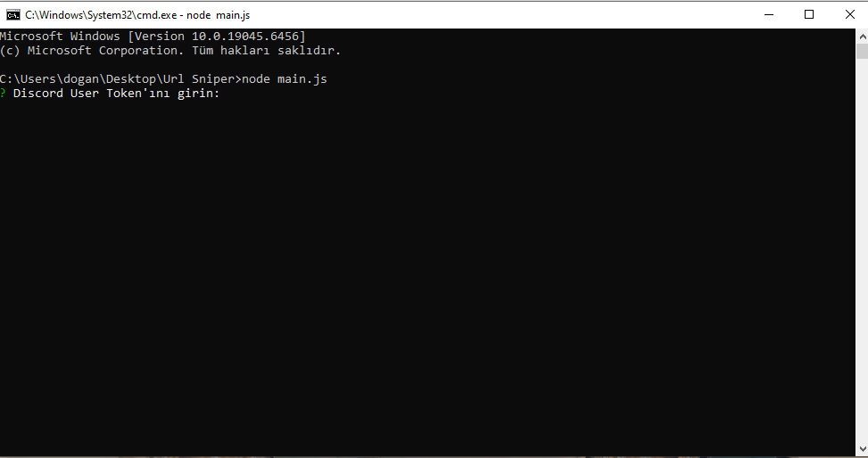

# Discord-Url-Sniper

**Description:** After downloading the system, install the necessary modules. Enter your Discord user token and select the server. The application will check the selected server every 5 minutes and continuously notify you about the server's Boost status. The application will run as long as the system is active!

-------------------------------------------------------
**Setup commands:**
```
npm init -y
```

```
npm install discord.js-selfbot-v13 inquirer
```

**Run:**
```
node main.js
```

-------------------------------------------------------


-------------------------------------------------------

**Getting support:**

[discord account](https://discord.com/channels/@me)


[Discord server](https://discord.gg/7yHSkrMZfg)
